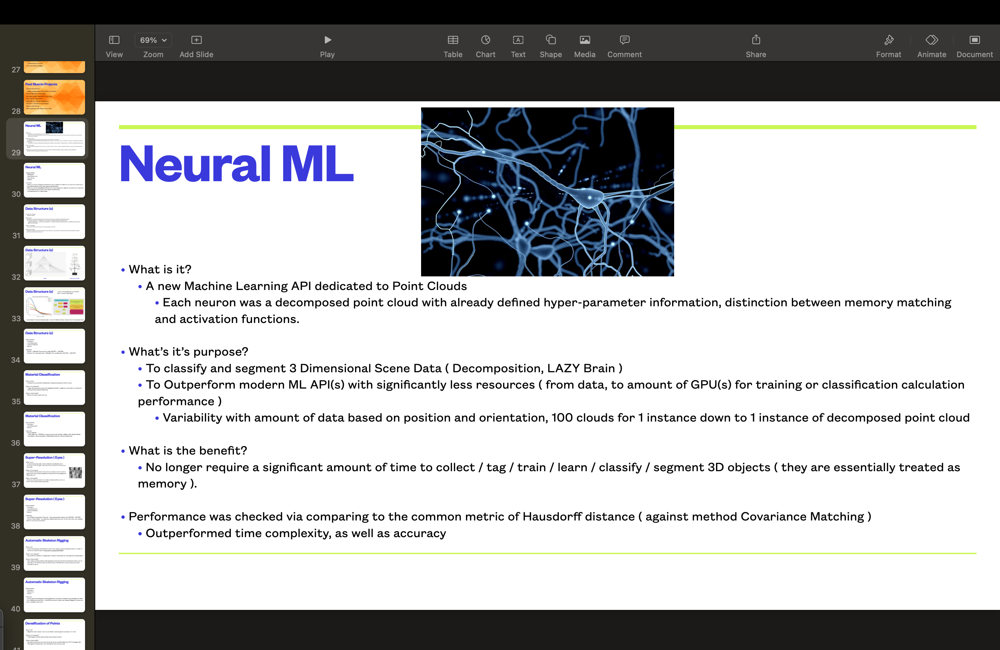

# 👋 Kevin Edward Dean — Data Scientist | Principal Engineer | Innovator

Welcome to my professional portfolio repository.  
This page serves as an overview of my career, philosophy, and technical body of work — providing context behind my professional journey and linking to my [career presentation (Google Drive)](https://drive.google.com/file/d/1OTn4FGuy-RpomlOSttQpGxnbBXm7HQq_/view?usp=sharing).

---

## 🧭 Introduction

I’m **Kevin Edward Dean**, a self-taught **Data Scientist, Engineer, and Innovator** with a career built on adaptability, creativity, and exploration.  
Throughout my journey — from **muon tomography and 3D visualization** to **machine learning pipelines and generative AI systems** — my guiding philosophy has been simple:

> “Just because I don’t know it today doesn’t mean I won’t know it tomorrow.”

This mindset has allowed me to thrive in high-paced startup environments, lead cross-functional technical teams, and innovate within domains where the solution wasn’t yet defined.

---

## 🌱 Personal Philosophy

I’m a **visual learner** fascinated by the relationship between data and reality — how numbers, patterns, and structures reveal truths about the world around us.

I believe in:
- **Active pattern recognition** — identifying recurring challenges across projects and anticipating systemic solutions.  
- **Transparent leadership** — mediating between management and junior engineers to ensure clarity, communication, and direction.  
- **Continuous learning** — investing in open-ended exploration through papers, design docs, and peer review.

> “It’s not the facilitator’s job to solve every problem — it’s to improve the quality of the team’s decision process.”

---

## 🧠 Technical Proficiencies

| Category | Skills & Tools |
|-----------|----------------|
| **Programming Languages** | Python, C++, CMake, Bash, Visual Basic |
| **Machine Learning / Deep Learning** | TensorFlow, scikit-learn, CoreML, XGBoost, AdaBoost, Random Forest |
| **3D Visualization & Data Structures** | VTK, ParaView, VisIt, Potree, Octree, Mutable Tree, PointCloud Data Structures |
| **Cloud & DevOps** | Azure, AWS, Azure DevOps, Docker, GitHub, GitLab |
| **Visualization & Analysis** | OpenCV, OpenGL, Eigen, HDF5, NumPy, Matplotlib |
| **Data Engineering** | Data wrangling, unstructured data management, point cloud processing |
| **Research & Algorithms** | 3D image reconstruction, clustering, segmentation, regression compression, SVD, neural network architectures |

---

## 🧩 Technical Leadership & Best Practices

In my leadership roles (Senior Data Scientist, Principal Engineer, Director of Engineering), I’ve emphasized **clarity, reproducibility, and mentorship**.

### Responsibilities:
- Mediated between upper management and engineering teams  
- Supervised backend C++ library and ML model integration  
- Mentored engineers across multiple departments  
- Managed machine learning pipelines and unstructured data assets  
- Conducted interviews, onboarding, and training  
- Proven impact through measurable statistical and visual analyses  

### Guiding Practices:
- Protect uninterrupted time for deep work  
- Document everything (algorithms, complexity, assumptions)  
- Promote reproducible and traceable code practices  
- Encourage conferences, learning, and knowledge sharing  
- Define clear project ownership and outcome accountability  

---

## 🔬 Major Technical Contributions

### **1. Neural ML — Point Cloud Classification API**
Developed a machine learning API for **3D scene classification and segmentation**.  
- Each neuron represented a decomposed point cloud  
- Outperformed standard ML APIs in speed and accuracy  
- Achieved **99% accuracy on ShapeNet** and **80% on ModelNet40**

**Outcome:** Top-5 category relations validated through covariance matching before SVM classification.

---

### **2. Mutable Tree Data Structure (MTDS)**
Invented and patented (US 11670052 B1) a **data structure for high-performance spatial computing**.  
- Achieved frame rate improvements from **99 FPS → 850 FPS** ; this was a second to final revision where I was profiling the way the mutable tree was gridded. As opposed to equivalent subvolumes per search tree, I created more variable sized volumes in slices similar to how DICOM (from what I've seen in the past) images are generated. Using a `Gaussian-style Traversal`, I was able to improve the frames per second from 405 fps to ~850 fps.
- Enabled real-time 3D visualization of massive point clouds (31B points)  
- Used in human brain tomography visualization at ESRF dataset

---

### **3. 3D Language Curator Project**
Personal initiative inspired by my autistic sons, combining:
- **Generative AI (LLMs)** for contextual responses  
- **Text-to-Speech (TTS)** for vocal learning feedback  
- **3D avatar animation** using Wav2Lip & SadTalker  

**Goal:** Build a multimodal learning system to help neurodiverse children develop language and social understanding.

---

### **4. Visualization and Simulation Engineering**
At **Decision Sciences** and **DAAC**, I contributed to:
- Muon tomography 3D reconstruction using deep learning  
- Health analysis visualization of detector systems  
- High-performance computing (HPC) simulation jobs across 55+ (Decision Sciences), 5000+ (DAAC; DoD) nodes  
- 3D Lidar fusion and container localization  
- Visualization pipelines for missile fluid dynamics and jet simulation  

---

## 📈 Career Highlights

| Company | Role | Focus |
|----------|------|-------|
| **Quantum Design** | Technician | System testing and magnetometer calibration |
| **Decision Sciences** | Data Scientist / Researcher | Muon tomography, neural segmentation, visualization |
| **DAAC** | Principal Modeling & Simulation Engineer | HPC visualization software, mesh coarsening |
| **Illuscio Inc.** | Principal Engineer / Director of Engineering | AI-driven 3D visualization, data structures, ML pipelines |

---

## 💡 Personal Research Interests

1. Generative AI and classical machine/deep learning for education and accessibility
    - Large Language Models (with Retrieval Augmentation)
    - Natural Language Processing
    - Healthcare / Finance / E-commerce
2. 3 Dimensional Rendering of High Density Data, with possible animation
    - creating a Content Delivery Network to outperform modern platforms
3. Spatial data structures for real-time rendering
    - Mutable Tree vs Octree in python to Show comparison 
4. Neural architectures for point cloud analysis
    - Compare Gaussian Splatting & NeRF against Gaussian Node Traversal Visualization
5. Hybrid compression and memory optimization  
6. Semantic segmentation and multi-modal learning
    - Autonomous Vehicles perception

---

## 🔗 Presentation Access

For a full, illustrated walkthrough of my background and research, please view the complete presentation here:  
➡️ [**Kevin Edward Dean – Career Presentation (Google Drive)**](https://drive.google.com/file/d/1OTn4FGuy-RpomlOSttQpGxnbBXm7HQq_/view?usp=sharing)

---

## ✉️ Contact

- **Email:** kevinedwarddean@gmail.com
- **GitHub:** [github.com/kevindean](https://github.com/kevindean)  
- **GitHub:** [github.com/kevindean87](https://github.com/kevindean87)  
- **LinkedIn:** [linkedin.com/in/kevinedwarddean](https://www.linkedin.com/in/kevin-dean-9a67a728/)  

---

### © 2025 Kevin Edward Dean  
All rights reserved. Professional portfolio intended for career presentation and educational purposes.
